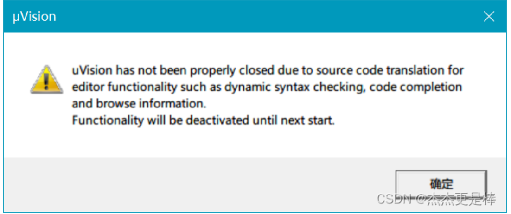
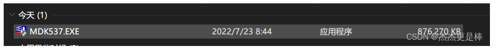
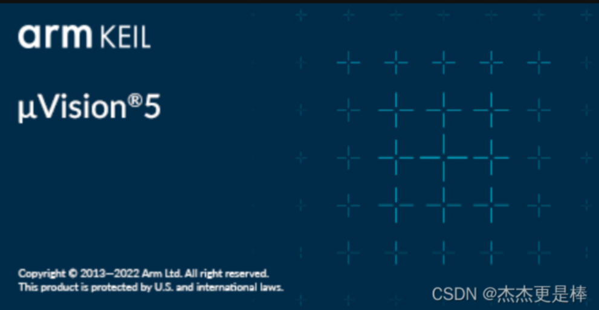

# STM32-MDK537
配置stm32环境总是报错，于是官网下了新版本，问题解决了

uVision has not been properly closed due to source code translation for editor functionality such as dynamic syntax checking, code completion and browse information.
Functionality will be deactivated until next start.

每次只要一打开32的project就得闪退，然后再次打开又跳出这个警告。
如此反复好几遍，尝试了别人的各种删注册表、更改路径 都未果

我下载了最新 keil MDK537 版本， 我觉得应该是版本的问题，我原来514的版本，试了好多方法都不行
这里我分享个537百度网盘链接：

[链接：https://pan.baidu.com/s/1y0pnzD3ZoegagIuiYjMh2A](https://pan.baidu.com/s/1y0pnzD3ZoegagIuiYjMh2A)
                       
提取码：1314 

ヽ（≧□≦）ノ （ 我自己从官网下的，效率太高了，下了我一晚上）ヽ（≧□≦）ノ

所以不妨可以去下载最新的版本！！！

开始界面长这样

